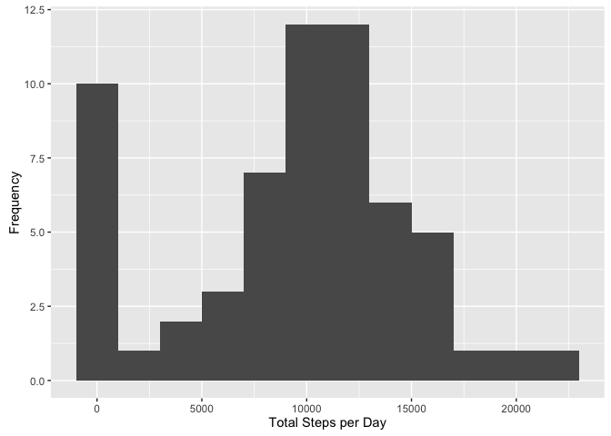
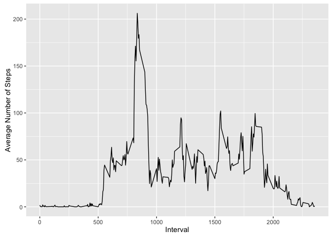
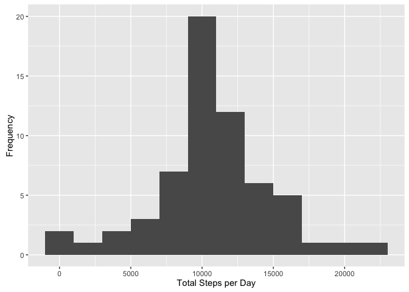
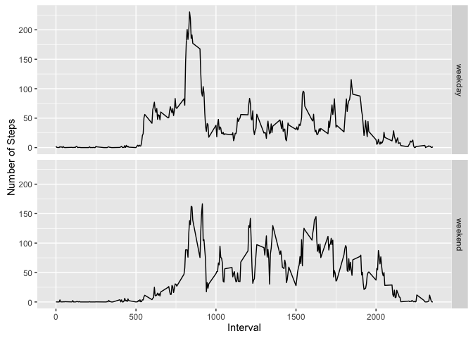

# Reproducible Research: Peer Assessment 1


## Loading and preprocessing the data

1. Load the data (i.e. read.csv())


```r
activity <- read.csv("activity.csv")
```

2. Process/transform the data (if necessary) into a format suitable for your analysis


```r
activity$date <- as.Date(activity$date, "%Y-%m-%d")
```


## What is mean total number of steps taken per day?

1. Calculate the total number of steps taken per day


```r
library(dplyr)
```

```
## 
## Attaching package: 'dplyr'
```

```
## The following objects are masked from 'package:stats':
## 
##     filter, lag
```

```
## The following objects are masked from 'package:base':
## 
##     intersect, setdiff, setequal, union
```

```r
steps_per_day <- activity %>%
                 group_by(date) %>%
                 summarize(total_steps = sum(steps, na.rm = TRUE))
```

2. If you do not understand the difference between a histogram and a barplot, research the difference between them. Make a histogram of the total number of steps taken each day


```r
library(ggplot2)
histogram <- ggplot(steps_per_day, aes(x = total_steps))
histogram + geom_histogram(binwidth = 2000) + labs(x = "Total Steps per Day", y = "Frequency")
```

<!-- -->

3. Calculate and report the mean and median of the total number of steps taken per day

The median is **10395** and the mean is **9354.2295082**.

## What is the average daily activity pattern?

1. Make a time series plot (i.e. type = "l") of the 5-minute interval (x-axis) and the average number of steps taken, averaged across all days (y-axis)


```r
average_interval <- activity %>%
                    group_by(interval) %>%
                    summarize(average_steps = mean(steps, na.rm = TRUE))
time_series <- ggplot(average_interval, aes(x = interval, y = average_steps))
time_series + geom_line() + labs(x = "Interval", y = "Average Number of Steps")
```

<!-- -->

2. Which 5-minute interval, on average across all the days in the dataset, contains the maximum number of steps?


```r
maximum_steps <- average_interval %>%
                 arrange(desc(average_steps)) %>%
                 slice(1)
```

The 5-minute interval with the maximum number of steps is 835, with 206.1698113 steps.

## Imputing missing values

Note that there are a number of days/intervals where there are missing values (coded as NA). The presence of missing days may introduce bias into some calculations or summaries of the data.

1. Calculate and report the total number of missing values in the dataset (i.e. the total number of rows with NAs)


```r
sum(is.na(activity$steps))
```

```
## [1] 2304
```

2. Devise a strategy for filling in all of the missing values in the dataset. The strategy does not need to be sophisticated. For example, you could use the mean/median for that day, or the mean for that 5-minute interval, etc.


```r
activity_without_na <- activity

for (i in 1:nrow(activity)) {
    if (is.na(activity$steps[i])) {
        current_interval_number <- activity$interval[i]
        current_interval <- subset(average_interval, interval == current_interval_number)
        activity_without_na$steps[i] <- current_interval$average_steps
    }
}
```

3. Create a new dataset that is equal to the original dataset but with the missing data filled in.


```r
head(activity_without_na)
```

```
##       steps       date interval
## 1 1.7169811 2012-10-01        0
## 2 0.3396226 2012-10-01        5
## 3 0.1320755 2012-10-01       10
## 4 0.1509434 2012-10-01       15
## 5 0.0754717 2012-10-01       20
## 6 2.0943396 2012-10-01       25
```

4. Make a histogram of the total number of steps taken each day and Calculate and report the mean and median total number of steps taken per day. Do these values differ from the estimates from the first part of the assignment? What is the impact of imputing missing data on the estimates of the total daily number of steps?


```r
steps_per_day <- activity_without_na %>%
                 group_by(date) %>%
                 summarize(total_steps = sum(steps, na.rm = TRUE))
histogram <- ggplot(steps_per_day, aes(x = total_steps))
histogram + geom_histogram(binwidth = 2000) + labs(x = "Total Steps per Day", y = "Frequency")
```

<!-- -->

The new median is **1.0766189\times 10^{4}** and the new mean is **1.0766189\times 10^{4}**.

We can see that the large column in the left (where the `NAs` were) is now gone.

## Are there differences in activity patterns between weekdays and weekends?

For this part the weekdays() function may be of some help here. Use the dataset with the filled-in missing values for this part.

1. Create a new factor variable in the dataset with two levels – “weekday” and “weekend” indicating whether a given date is a weekday or weekend day.


```r
new_activity <- activity_without_na
new_activity$day_type <- ifelse(weekdays(new_activity$date) %in% c("Sábado", "Domingo"), "weekend", "weekday")
```

It's important to note that "Sábado" and "Domingo" are the portuguese names of "Saturday" and "Sunday", as I'm running the script in a pt-BR locale.

2. Make a panel plot containing a time series plot (i.e. type = "l") of the 5-minute interval (x-axis) and the average number of steps taken, averaged across all weekday days or weekend days (y-axis). See the README file in the GitHub repository to see an example of what this plot should look like using simulated data.


```r
weekends <- filter(new_activity, day_type == "weekend")
weekdays <- filter(new_activity, day_type == "weekday")

grouped_weekends <- weekends %>%
                    group_by(interval) %>%
                    summarize(average_steps = mean(steps)) 
grouped_weekends$day_type <- "weekend"

grouped_weekdays <- weekdays %>%
                    group_by(interval) %>%
                    summarize(average_steps = mean(steps)) 
grouped_weekdays$day_type <- "weekday"

all_days <- rbind(grouped_weekends, grouped_weekdays)

time_series <- ggplot(all_days, aes(interval, average_steps))
time_series + geom_line() + facet_grid(day_type ~ .) + labs(x = "Interval", y = "Number of Steps")
```

<!-- -->
